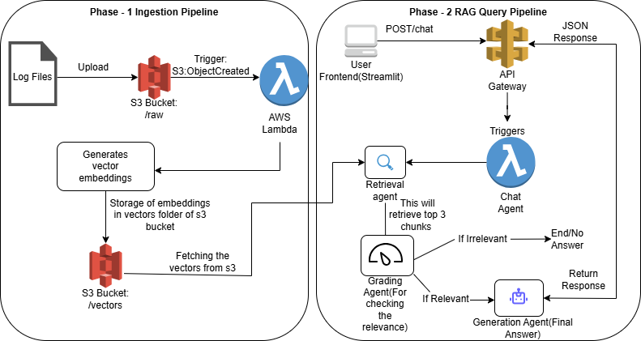

# Serverless DevOps Log Analysis Agent 🤖

A serverless RAG (Retrieval-Augmented Generation) application built on AWS that analyzes server logs and provides actionable solutions using Google Gemini AI.



## 📖 Project Overview

This project represents the **"Brain"** of an enterprise-grade log analysis system.

In a full-scale production environment, logs would stream continuously from AWS CloudWatch via Firehose. For this **Proof of Concept (PoC)**, I focused on building the core intelligence logic: a system that ingests a "Knowledge Base" of historical error logs, indexes them into a vector database, and uses a multi-step AI workflow to reason out solutions for new incidents.

## 🚀 Key Features

* **Serverless Architecture:** Fully deployed on AWS Lambda, S3, and API Gateway using Terraform. Costs $0.00 when idle.
* **Dual-Robot System:**
    * **Ingest Worker:** Automatically processes log files uploaded to S3, converting them into vector embeddings.
    * **Chat Agent:** A Reasoning Agent that answers user questions via a Streamlit UI.
* **Intelligent RAG Pipeline:**
    * Uses **FAISS** for semantic search.
    * Uses **LangGraph** to create a self-correcting workflow (Retrieve -> Grade -> Generate).
    * **Self-Grading:** The AI critiques retrieved logs to ensure relevance before answering, preventing hallucinations.
* **Infrastructure as Code:** Complete AWS environment provisioned via **Terraform**.

---

## 🛠️ Tech Stack

* **Cloud:** AWS (Lambda, S3, API Gateway, ECR, IAM)
* **IaC:** Terraform
* **AI Model:** Google Gemini 2.0 Flash
* **Orchestration:** LangChain & LangGraph
* **Vector DB:** FAISS (CPU)
* **Frontend:** Streamlit (Python)

---

## 📂 Project Structure

```text
.
├── aws_cloud/          # Terraform Infrastructure code (IaC)
│   ├── lambda.tf       # Defines Chat & Ingest functions
│   ├── s3.tf           # S3 Bucket & Event Notifications
│   ├── api_gateway.tf  # HTTP API trigger for the Chat Agent
│   └── ...
├── backend/            # Python Source Code
│   ├── agent.py        # LangGraph Workflow (The "Brain")
│   ├── ingest.py       # Vector DB Creation (The "Learner")
│   ├── lambda_function.py # Handler for Chat API
│   └── Dockerfile      # Container definition for AWS Lambda
└── frontend/           # Streamlit UI
    └── app.py          # Chat Interface for testing
